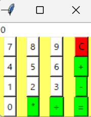

# Calculator-GUI

Pythonの標準ライブラリ `tkinter` を用いて作成した、簡単な電卓アプリケーションです。  
足し算・引き算・掛け算・割り算の基本的な4則演算に対応しています。

## 画面イメージ


GUIが表示され、数字ボタンと演算ボタンで操作できます。

## 機能一覧

- 数値の入力（0〜9）
- 計算結果の表示
- 以下の演算に対応：
  - 加算（+）
  - 減算（-）
  - 乗算（×）
  - 除算（÷）
- Cボタンで入力クリア
- GUI上でのリアルタイム反映

## 実行方法

### 必要環境
- Python 3.x（3.8以上推奨）

### 実行コマンド

```bash
python p11-2-correct.py
```
